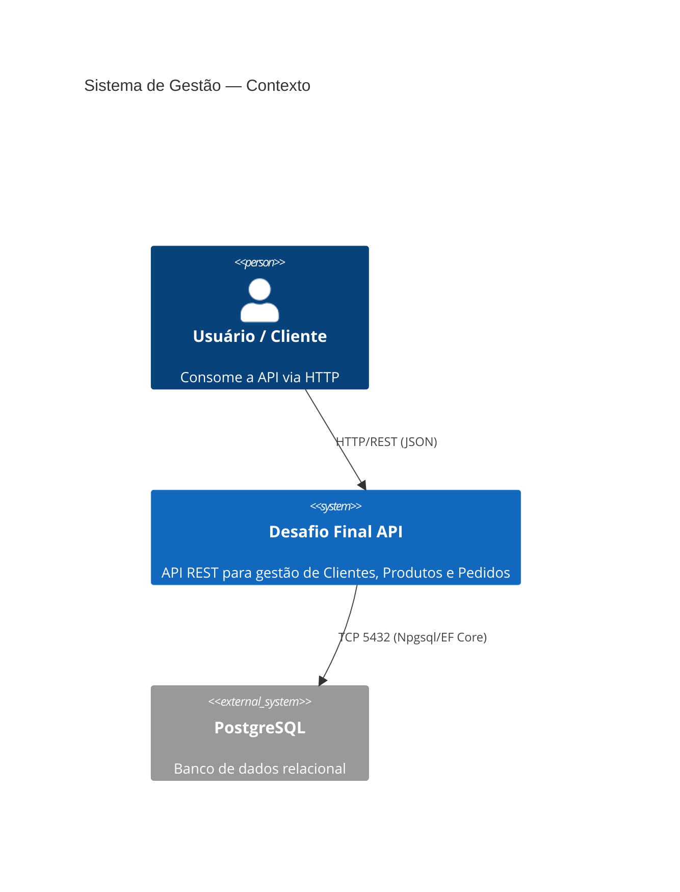
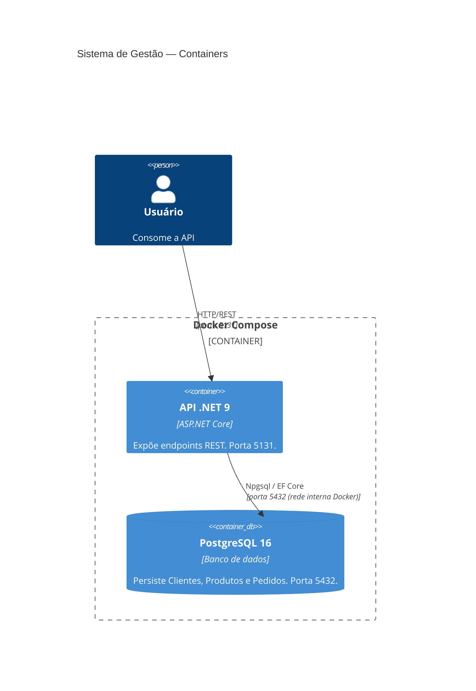
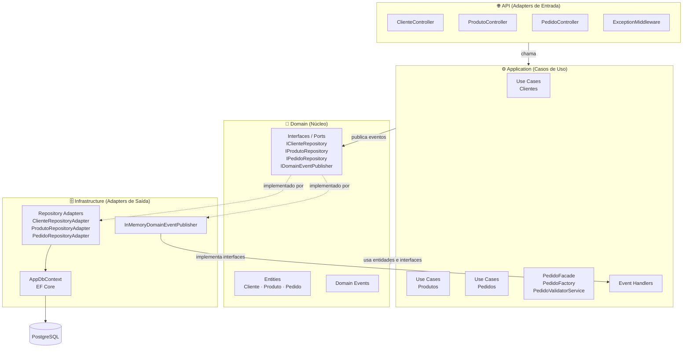
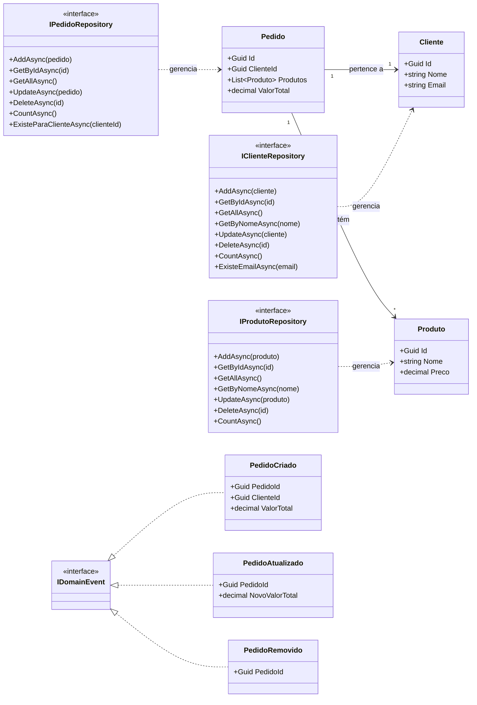
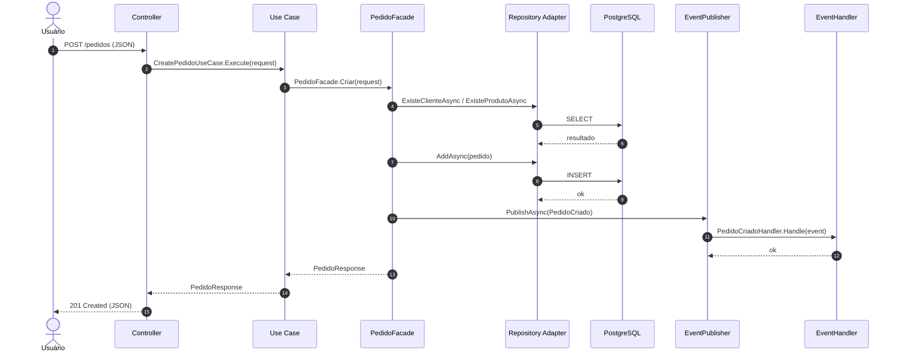

# Desafio Final — API REST com Arquitetura Hexagonal

API REST para gestão de **Clientes**, **Produtos** e **Pedidos**, construída em **.NET 9** com arquitetura hexagonal (Ports & Adapters), PostgreSQL e suporte a Docker.

---

## Sumário

- [Estrutura de Pastas](#estrutura-de-pastas)
- [Descrição dos Componentes](#descrição-dos-componentes)
- [Arquitetura](#arquitetura)
  - [C4 — Nível 1: Contexto](#c4--nível-1-contexto)
  - [C4 — Nível 2: Containers](#c4--nível-2-containers)
  - [C4 — Nível 3: Componentes (Hexagonal)](#c4--nível-3-componentes-hexagonal)
  - [Diagrama de Classes — Domínio](#diagrama-de-classes--domínio)
  - [Fluxo de uma Requisição](#fluxo-de-uma-requisição)
- [Como executar](#como-executar)
- [Endpoints](#endpoints)

---

## Estrutura de Pastas

```
desafio-final/
│
├── Domain/                          # Núcleo do negócio — sem dependências externas
│   ├── Entities/                    # Entidades e value objects do domínio
│   │   ├── Cliente.cs
│   │   ├── Produto.cs
│   │   └── Pedido.cs
│   ├── Events/                      # Eventos de domínio
│   │   ├── PedidoCriado.cs
│   │   ├── PedidoAtualizado.cs
│   │   └── PedidoRemovido.cs
│   └── Interfaces/                  # Ports (contratos que o domínio expõe)
│       ├── IClienteRepository.cs
│       ├── IProdutoRepository.cs
│       ├── IPedidoRepository.cs
│       ├── IDomainEvent.cs
│       ├── IDomainEventPublisher.cs
│       └── IEventHandler.cs
│
├── Application/                     # Casos de uso e orquestração
│   ├── UseCases/                    # Um arquivo por operação
│   │   ├── Clientes/                # Create, Read, Update, Delete, Count, GetByName, GetAll
│   │   ├── Produtos/                # Create, Read, Update, Delete, Count, GetByName, GetAll
│   │   └── Pedidos/                 # Create, Read, Update, Delete, Count, GetAll
│   ├── DTOs/                        # Objetos de transferência de dados (Request/Response)
│   ├── Validators/                  # Validações com FluentValidation
│   ├── Facades/                     # Orquestração de operações complexas de Pedido
│   │   ├── PedidoFacade.cs
│   │   ├── PedidoFactory.cs
│   │   └── PedidoValidatorService.cs
│   ├── EventHandlers/               # Handlers dos eventos de domínio
│   └── Exceptions/                  # Exceções de negócio (BusinessRuleException, NotFoundException)
│
├── Infrastructure/                  # Adapters — implementações concretas
│   ├── Database/
│   │   └── AppDbContext.cs          # DbContext do Entity Framework Core
│   ├── Persistence/                 # Implementações dos repositórios (Adapters)
│   │   ├── ClienteRepositoryAdapter.cs
│   │   ├── ProdutoRepositoryAdapter.cs
│   │   └── PedidoRepositoryAdapter.cs
│   ├── Migrations/                  # Migrations do EF Core
│   └── EventPublisher/
│       └── InMemoryDomainEventPublisher.cs
│
├── Api/                             # Camada de apresentação — entrada HTTP
│   ├── Controllers/                 # Controllers REST
│   │   ├── ClienteController.cs
│   │   ├── ProdutoController.cs
│   │   └── PedidoController.cs
│   ├── Middleware/
│   │   └── ExceptionMiddleware.cs   # Tratamento global de erros
│   ├── Program.cs                   # Composição do app e injeção de dependências
│   ├── appsettings.json
│   └── appsettings.Development.json
│
├── Tests/                           # Testes automatizados
│   ├── UseCases/                    # Testes de casos de uso
│   ├── Validators/                  # Testes de validadores
│   ├── Facades/                     # Testes de facades
│   └── Helpers/                     # Utilitários (MockDbContextHelper)
│
├── Dockerfile                       # Build e runtime da API
├── docker-compose.yml               # Orquestração API + PostgreSQL
└── README.md
```

---

## Descrição dos Componentes

| Componente | Camada | Responsabilidade |
|---|---|---|
| **Entities** (`Domain/Entities`) | Domain | Representam os conceitos centrais do negócio: `Cliente`, `Produto` e `Pedido`. São independentes de qualquer framework. `Cliente` e `Produto` são imutáveis (`record`); `Pedido` é mutável para suportar atualização via EF Core. |
| **Interfaces / Ports** (`Domain/Interfaces`) | Domain | Contratos que o domínio define e espera que sejam implementados externamente. `IClienteRepository`, `IProdutoRepository` e `IPedidoRepository` são as _ports_ de saída. |
| **Domain Events** (`Domain/Events`) | Domain | Eventos que representam fatos ocorridos no domínio (`PedidoCriado`, `PedidoAtualizado`, `PedidoRemovido`). |
| **Use Cases** (`Application/UseCases`) | Application | Encapsulam uma única operação de negócio. Dependem apenas das interfaces do domínio — nunca da infraestrutura diretamente. |
| **DTOs** (`Application/DTOs`) | Application | Objetos de entrada (`Request`) e saída (`Response`) que trafegam entre a API e os casos de uso. Isolam o domínio do contrato HTTP. |
| **Validators** (`Application/Validators`) | Application | Validam os dados de entrada usando FluentValidation antes de chegar nos casos de uso. |
| **Facades** (`Application/Facades`) | Application | `PedidoFacade` orquestra operações complexas que envolvem múltiplos repositórios e eventos. `PedidoFactory` cria e atualiza objetos `Pedido`. `PedidoValidatorService` verifica existência de entidades relacionadas. |
| **Event Handlers** (`Application/EventHandlers`) | Application | Reagem a eventos de domínio publicados após operações de `Pedido`. |
| **Repository Adapters** (`Infrastructure/Persistence`) | Infrastructure | Implementam os contratos do domínio usando EF Core + PostgreSQL. São os _adapters_ de saída da arquitetura hexagonal. |
| **AppDbContext** (`Infrastructure/Database`) | Infrastructure | Contexto do EF Core. Mapeia entidades para tabelas e configura relacionamentos. |
| **InMemoryDomainEventPublisher** (`Infrastructure/EventPublisher`) | Infrastructure | Publica eventos de domínio em memória, resolvendo handlers via DI. |
| **Controllers** (`Api/Controllers`) | Api | Recebem requisições HTTP, delegam para os casos de uso e retornam respostas. São os _adapters_ de entrada. |
| **ExceptionMiddleware** (`Api/Middleware`) | Api | Captura exceções de negócio (`NotFoundException` → 404, `BusinessRuleException` → 409, `ValidationException` → 400) e retorna JSON padronizado. |
| **Program.cs** | Api | Ponto de entrada. Compõe o container de DI registrando todos os serviços, repositórios, casos de uso e configurações. |

---

## Arquitetura

### C4 — Nível 1: Contexto



---

### C4 — Nível 2: Containers



---

### C4 — Nível 3: Componentes (Hexagonal)



> **Regra central da arquitetura hexagonal:** a camada `Domain` não conhece nenhuma das outras. `Application` conhece apenas `Domain`. `Infrastructure` e `Api` conhecem todas as camadas acima, mas nunca são referenciadas por elas.

---

### Diagrama de Classes — Domínio



---

### Fluxo de uma Requisição



---

## Como executar

### Com Docker (recomendado)

```bash
docker-compose up --build
```

- API disponível em: `http://localhost:5131`
- Swagger UI: `http://localhost:5131` (rota raiz)
- PostgreSQL: `localhost:5432`

### Localmente (sem Docker)

Pré-requisitos: .NET 9 SDK e PostgreSQL rodando em `localhost:5432`.

```bash
dotnet restore
dotnet run --project Api
```

---

## Endpoints

| Método | Rota | Descrição |
|--------|------|-----------|
| `POST` | `/clientes` | Criar cliente |
| `GET` | `/clientes` | Listar todos os clientes |
| `GET` | `/clientes/{id}` | Buscar cliente por ID |
| `GET` | `/clientes/nome/{nome}` | Buscar cliente por nome |
| `GET` | `/clientes/count` | Contar clientes |
| `PUT` | `/clientes/{id}` | Atualizar cliente |
| `DELETE` | `/clientes/{id}` | Remover cliente |
| `POST` | `/produtos` | Criar produto |
| `GET` | `/produtos` | Listar todos os produtos |
| `GET` | `/produtos/{id}` | Buscar produto por ID |
| `GET` | `/produtos/nome/{nome}` | Buscar produto por nome |
| `GET` | `/produtos/count` | Contar produtos |
| `PUT` | `/produtos/{id}` | Atualizar produto |
| `DELETE` | `/produtos/{id}` | Remover produto |
| `POST` | `/pedidos` | Criar pedido |
| `GET` | `/pedidos` | Listar todos os pedidos |
| `GET` | `/pedidos/{id}` | Buscar pedido por ID |
| `GET` | `/pedidos/count` | Contar pedidos |
| `PUT` | `/pedidos/{id}` | Atualizar pedido |
| `DELETE` | `/pedidos/{id}` | Remover pedido |
